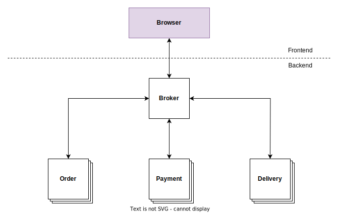

# EventDrivenArchitecturePlayground

## Description
This is a small suite of Node applications, meant to be deployed as independent services within an event-driven architecture (EDA). The use case behind this architecture is the implementation of the backend of a simple online shop.

## Services
In this system, every individual service (or app) has a unique responsibility. Services communicate with each other via the emission of events to a broker. Here is a list of short descriptions for said services:

### Broker
This service takes care of relaying events in-between service.

### Order
This service takes care of order creation/deletion.

### Payment
This service takes care of order payments.

### Delivery
This services takes care of order shipments.

## Architecture
Below is a diagram of the architecture of this app. For now, the broker is responsible of the communication with the browser. There is no frontend, per se, that's part of this prototype.

  

## Event Flow
Below is a diagram of the event flow implemented in this app. Each square represents the emission of an event. Each diamond represents a process, which takes place in one of the aforementioned services.

  

